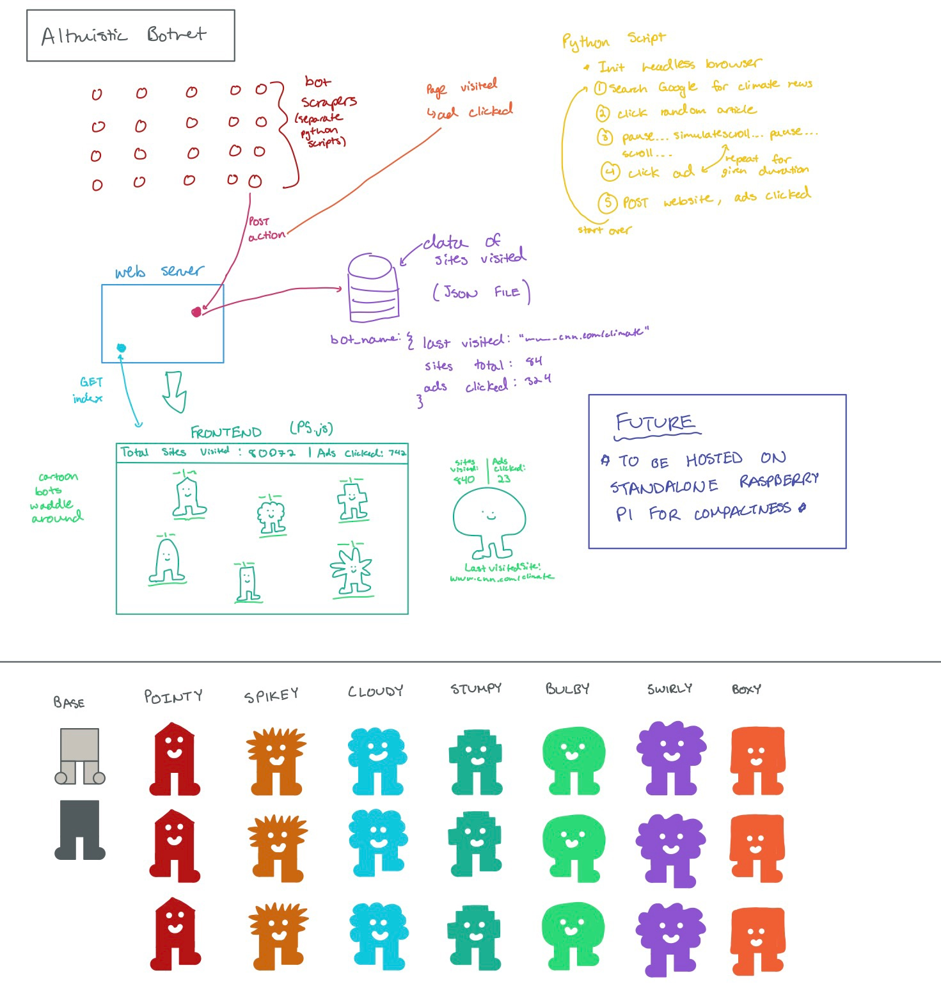
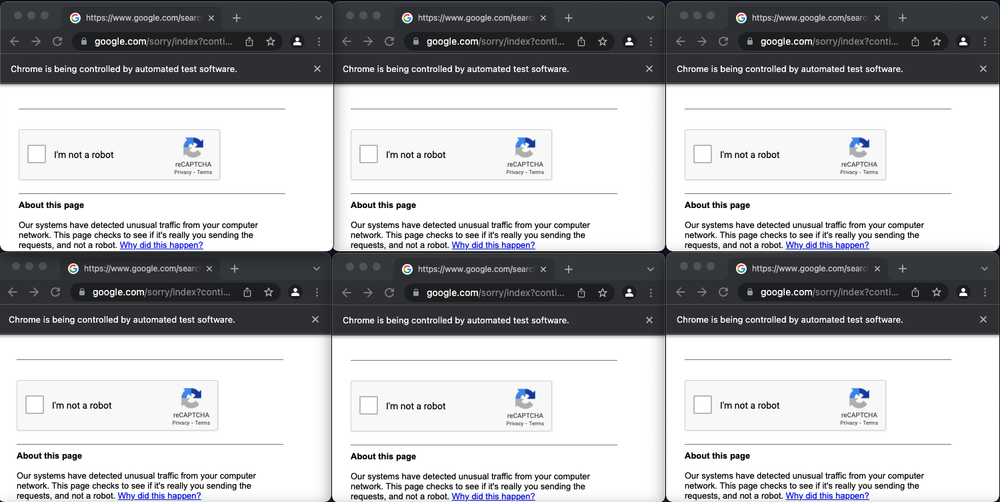
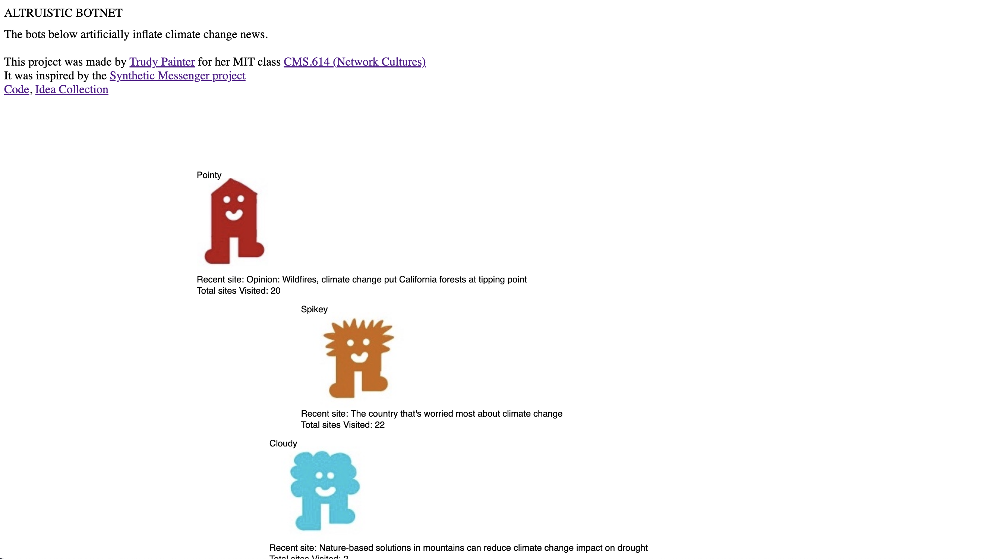

# ALTRUISTIC BOTNET

This is a climate change news inflation botnet I made for my class [Network Cultures (CMS.614)](https://docs.google.com/document/d/1kHGED28lU4xAXI8FkIpPelVSYoU7jHP4J268Iuyxq4c/edit).

<iframe src="https://player.vimeo.com/video/686531358?h=346f2472e8&amp;badge=0&amp;autopause=0&amp;player_id=0&amp;app_id=58479" frameborder="0" allow="autoplay; fullscreen; picture-in-picture" allowfullscreen style="position:absolute;top:0;left:0;width:100%;height:100%;" title="botnet frontend"></iframe>

<iframe src="https://player.vimeo.com/video/686531270?h=dd7bdae4d8" style="position:absolute;top:0;left:0;width:100%;height:100%;" frameborder="0" allow="autoplay; fullscreen; picture-in-picture" allowfullscreen></iframe>

## Inspiration

I love surfing the internet. It’s a broad statement. But over quarantine, I spent a majority of my time on the website [Are.na](http://are.na). It’s used in a lot of design and alternative academia spaces for idea collection and sharing - kind of like Pinterest.

Last fall, I clicked on a block that took me to [“Synthetic Messenger.”](https://syntheticmessenger.labr.io/#) It was a dead botnet that used to artificially inflate the traffic around climate change. I was fascinated by it. I’d never seen a botnet displayed so publicly, and I’d never thought about how a botnet could be used for good. And, I wanted to know why it was taken down.

I emailed the creators, [Tega Brain](http://tegabrain.com/) and [Sam Lavine](https://lav.io/), peppering them with technical questions and intentions behind the design. A week later, Sam responded. He let me know that the original project was a video installation that broadcasted the bots’ clicks and scrolls in real time. This installation was expensive. And the duo only got enough funding to run the botnet for the duration of a week-long conference. So at the end of the conference, the botnet was taken down.
Sam encouraged me to pursue my own version of an altruistic botnet and sent me fantastic resources for web scraping. After that email, I added a climate change botnet to my list of side project ideas.

## Ideation

I didn’t start working on implementing my version of a botnet right away, though. I thought their botnet was an awesome example of an altruistic side project. However, the coldness and impersonal nature of the bots didn’t sit well with me. Each of the bots were doing good for the world! They were also performing real human actions. Clicking, scrolling, searching. It felt more human than robot spreadsheet to me.
So, I started thinking about how I would want a botnet to feel. I wanted the bots to feel friendly and fuzzy and slow. They didn’t need to be perfectly tuned and optimized. They just need to try their best (and so did I as the programmer). I collected images of cartoon character casts, gardens, and insects. These inspiring images and some technical resources are found in this [channel](https://www.are.na/trudy-painter/altruism-bots).

I resolved to think about this botnet as a garden where bots grow, mingle, and get up to mischief. In his essay “Ethical Bot-making,” Martin O’Leary discusses the notion of “punching up.” In his essay, he’s referencing making jokes about those in power instead of those oppressed. However, this notion still applies to my botnet. I’m framing my botnet as pesty and mischievous. I know the little bots don’t actually do that much to sway the global political attitude toward climate change. However, they are performing objective net positive good.

This is a personal note, but a lot of the software side projects I’ve done in the past have been noisy or helpful only to me. I’ve made personal listening visualizers and generative twitter bots. There’s nothing wrong with a silly tweet generator, but it doesn’t really improve the world. It primarily benefits my personal learning. This climate change botnet provided a way for me to explore new engineering concepts through a humanitarian purpose.

After all this ruminating, I didn’t touch the project for 3 months.

## And then, a reason to start

When I heard about the social artifact project in this class, I knew right away what I would do. This would be the perfect way to hold myself accountable and complete the botnet. This class has also provided me with new ways to frame the project and human versus nonhuman agents. There were a few major concepts that stuck out to me.

Bogost’s carpentry paper sucked me in and flipped how I frame my personal projects. I always described coding as a flow state for me. Logically piecing together system components felt like magic to me. I would try to describe this process as making “art” to some people but that honestly never sat well with me. But carpentry? Carpentry felt like the perfect way to describe my array of side projects. A majority of my side projects start from a skill I want to learn, and the product follows. The following statement in Bogost’s paper stuck with me: “Knowledge, he concludes, ‘does not exist. . . . Despite all claims to the contrary, crafts hold the key to knowledge.’”

On Kazemi’s, “The Strange Journey of Metaphor-a-Minute,” I know that there is no way that my little bots would ever spew anything harmful. They have no voice. However, these bots do still interact directly with the human world. The bots interact with news websites and a human audience perceives the bots. With this in mind, I tried to mimic human scroll, click, search behavior as closely as possible - with pauses and random decisions. O’Leary also makes the point that “it is a mistake to assume that the audience for a bot understands what the bot is doing. Often, the audience will have little understanding of bots in general. Sometimes they develop ideas about the bot which are false.” So, I tried to make these bots as personified as possible so that they are easily digestible and accessible for a human audience.

In Stuart Geiger’s “The Lives of Bots,” he discusses the Bruno Latour framing of human vs nonhuman agents, specifically the example of police officers vs speed bumps enforcing speed limits. Speed bumps might be nonhuman, but this does not mean there is no human meaning behind them. The speed bumps were installed by humans to enforce a speed limit law. We can apply this way of thinking towards this botnet. Yes, the bots are not human. However, they were designed by a human with the intention to inflate media circulation around climate change.

## Tech Specs

Below, I’ve included a system diagram. I drew it on my iPad and have intentionally left it unpolished and personal. It runs on my local machine and uses Python, headless Chrome browsers, and a basic HTML site.
I have no background in art, so I strategically designed the characters to be simple yet uniform in design language. I gave them all names to add to the friendly feel of the botnet.

Also, the scale of this botnet is limited. Similar to what I was saying above, this botnet does not need to be perfect or optimized for performance. I wanted it to feel friendly and mischievous. So, there are only seven bots, all personalized.

The final implementation was difficult. The botnet is expensive to run on my computer. And the bots eventually got flagged by Google and my IP was blocked before I could continue to run. I tried my best to make the bots look as human as possible. They run at slower, randomized speeds. However, my IP was sending an unusually similar and large quantity of traffic to Google over and over again.

Below are screenshots of the error messages from Google.

To implement the frontend, I used p5.js. The static site is minimal. The bots have little animations where they dance across the screen and display the most recent article they visited as well as the total number of sites they visited. As you can see, they only got up to about 20 before they were blocked by Google.

I’ve uploaded my code to this [Github Repository](https://github.com/trudypainter/altruistic-botnet).

## Final Note

I realized that the mission statement can get lost in the development. However, I’ve learned that a clear purpose and defined feeling can keep me on track. I benefited from iterations of project framing over multiple months. Visual inspirations and drawings were also effective guides when I got lost in intense debugging and refactoring.

In the future, I want to use a dedicated Raspberry Pi server for this botnet. Ideally, it will be solar powered and standalone. Additionally, I will have to look into different botnet techniques to avoid having my IP address blocked again.

## Sources

Bogost, ["Carpentry: Constructing Artifacts That Do Philosophy"](https://quote.ucsd.edu/sed/files/2016/04/Bogost.pdf) in Alien Phenomenology (2012)

Kazemi, "The Strange Journey of Metaphor-a-Minute" (2012)

O'Leary, "Ethical bot-making," (n.d.)

Geiger, "The Lives of Bots," in Critical Point of View: A Wikipedia Reader (2011)

Github repo: https://github.com/trudypainter/altruistic-botnet Botnet in action: https://vimeo.com/686531270

Botnet frontend demo: https://vimeo.com/686531358

Are.na channel: https://www.are.na/trudy-painter/altruism-bots Synthetic Messenger: https://syntheticmessenger.labr.io/#
