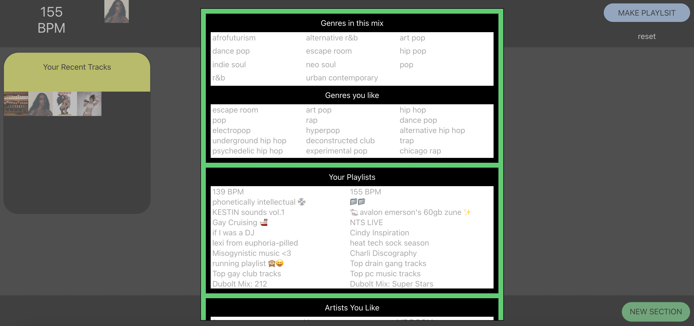

# SPOTIFY BPM

Over January of 2022, I was in a DJ class. I had so much fun making my first mix. But then I realized it sounded bad to everyone else because the beats of the songs were different.

I also didn't have a full library built in the DJ software, so I was manually looking up songs' BPM. This was not effective.

To help with finding songs with compatible BPM, I made this Spotify library explorer using the [Spotify API](https://developer.spotify.com/documentation/web-api/reference/#/).

I would tell you to try it out on your own, but the API team rejected my request for an app extension (because it's a "hobby project" 😔). If you would like to use it, I can add you to the list of approved accounts, though!

Below is the video demo I submitted to try to get it approved. And here is the [repository](https://github.com/trudypainter/spotify-bpm-explorer-2)!

<iframe src="https://player.vimeo.com/video/669413796?h=e4f20f2815&amp;badge=0&amp;autopause=0&amp;player_id=0&amp;app_id=58479" frameborder="0" allow="autoplay; fullscreen; picture-in-picture" allowfullscreen style="position:absolute;top:0;left:0;width:100%;height:100%;" title="Spotify BPM Demo"></iframe>

