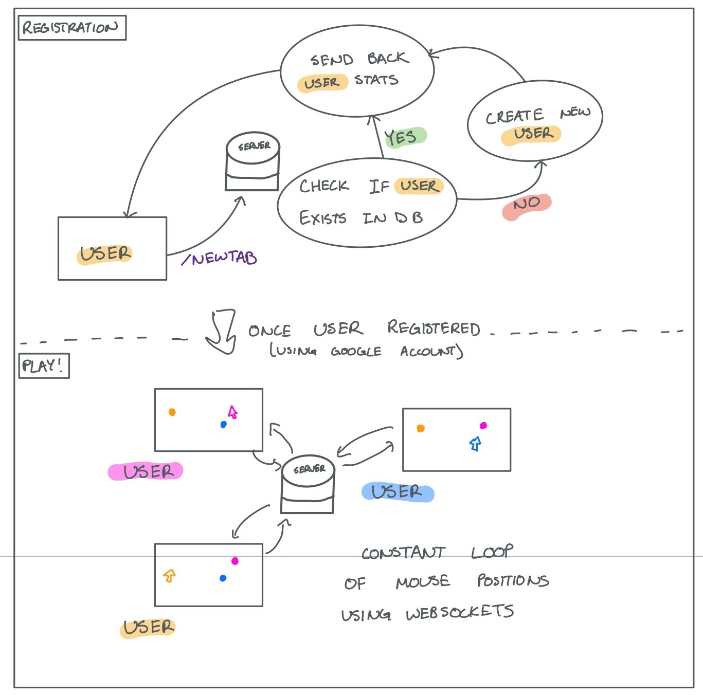
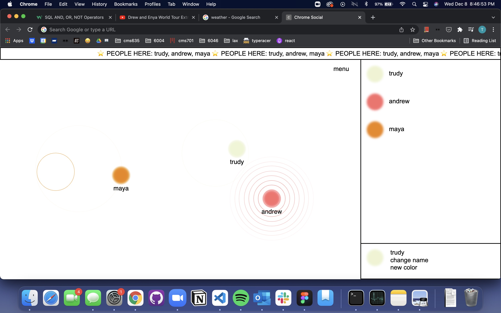

# CHROME SOCIAL

_NOTE: This project was more thought experiment than full blown software development_

### Intention

I spent all of my sophomore year at MIT taking virtual classes. When I went back to campus my junior year, I noticed that my favorite part of going to class was running into people and saying hello.

I found myself taking longer routes to classes where I knew I would bump into people. It made me wonder how I could replicate quick, serendipitous interactions online.

I didn't want to make a new platform that people had to go to (ie a new app or website). I wanted to find a passive way to slip human connections into already existing digital workflows.

_What's a digital platform we all use that can be modified for social interactions?_

BOOM! Google Chrome 😎

A lot of my friends and I use Apple products, but Apple doesn't let you alter their software. However, most of my friends and I DO use Google Chrome (which DOES let you modify their software). So, I made a new tab Chrome extension where you can see other users' mouse movements in real time. The interactions are limited and fleeting, just like running into someone between classes.

---

### Design

I made this using [Google Chrome extensions](https://developer.chrome.com/docs/extensions/), [Websockets](https://developer.mozilla.org/en-US/docs/Web/API/WebSockets_API/Writing_WebSocket_servers), and [P5js](https://p5js.org/). User data is also stored in a Heroku server using SQL.

_I ran into websocket/server bugs and stopped development after it was taking up too much time. I learned what I wanted about web sockets and chrome extensions._

Below is a demo (where the site breaks oops) and a system diagram.

<iframe src="https://player.vimeo.com/video/661990464?h=c1f499a28b&amp;badge=0&amp;autopause=0&amp;player_id=0&amp;app_id=58479" frameborder="0" allow="autoplay; fullscreen; picture-in-picture" allowfullscreen style="position:absolute;top:0;left:0;width:100%;height:100%;" title="IMG_4808.mov"></iframe>

