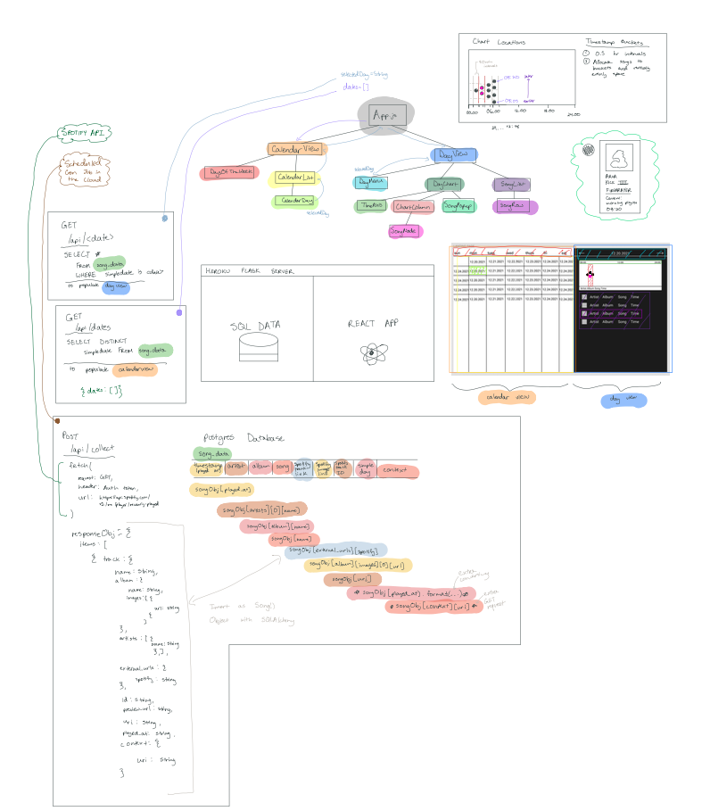

# SPOTIFY LISTENING EXPLORER v2.0

In 2020, I made a [mood tracker for my Spotify listening behavior](/spotify-mood-tracker). I learned a lot of valuable skills about APIs, data organizing, and visualizations.

However, there were a few things I thought could be improved from this site.

1. The site was not reliable.
   - I collected songs using a scheduled task on my physical MacBook. So, if I had my computer turned off or was not connected to the internet, the data wouldn't be collected.
   - The data was also stored in CSV files in Github. This is a crafty, free solution. However, this isn't best practice for storing lots of large data.
2. The site was made using plain HTML/JS/CSS.
   - This implement was fine for this specific project, but I wanted to practice making more modular sites for the next project (React)
3. The mood graph was non-sensical
   - I thought the mood indices provided by the Spotify API would be more insightful. But, the graphs didn't make much sense.

---

This time, I wanted to make a listening tracker that was reliable, modular, and insightful.

So, this listening tracker is a React app with a Flask backend (hosted on Heroku). And the listening data is stored in an SQL database.

[Check out my listening history! 🐸](https://react-flask-listening.herokuapp.com/)

Below is a demo and diagram of the new site.

<iframe src="https://player.vimeo.com/video/661674779?h=8a3ee9031d&amp;badge=0&amp;autopause=0&amp;player_id=0&amp;app_id=58479" frameborder="0" allow="autoplay; fullscreen; picture-in-picture" allowfullscreen style="position:absolute;top:0;left:0;width:100%;height:100%;" title="Spotify Visualizer Demo"></iframe>

