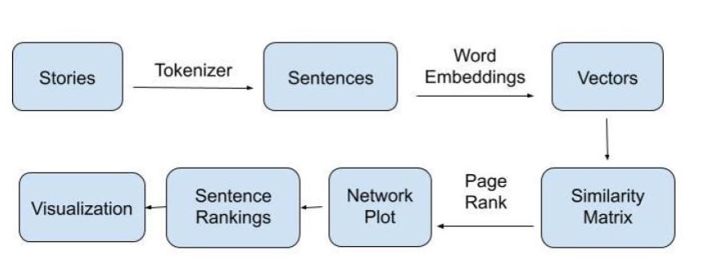

# PERSONAL NARRATIVE PREDICTOR

Over January of 2020, I worked under [Belen Saldias](https://belencarolina.com/) in the [Laboratory for Social Machines](https://www.media.mit.edu/groups/social-machines/overview/), designing a machine learning model for personal stories.

Check out my contributions in this [repository](https://github.com/trudypainter/Personal-Narrative-Predictor).

Or, take a look at her [final presentation](https://github.com/social-machines/acl-nuse-personal-narratives).

