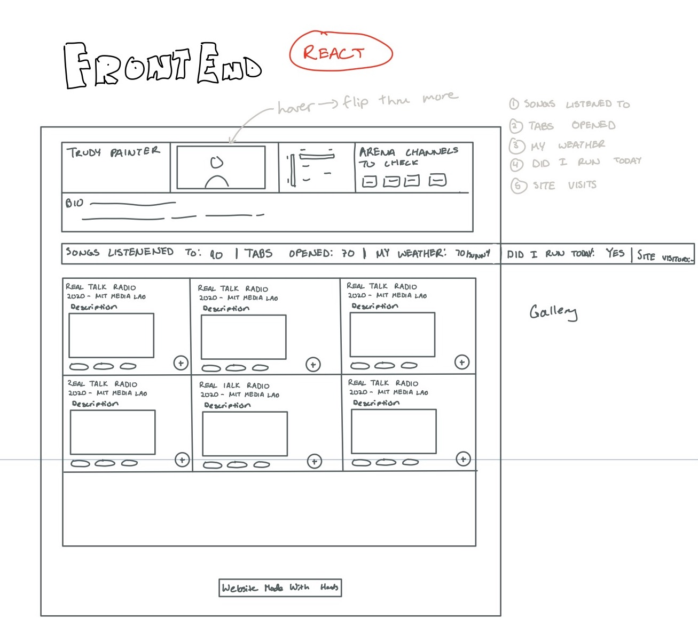
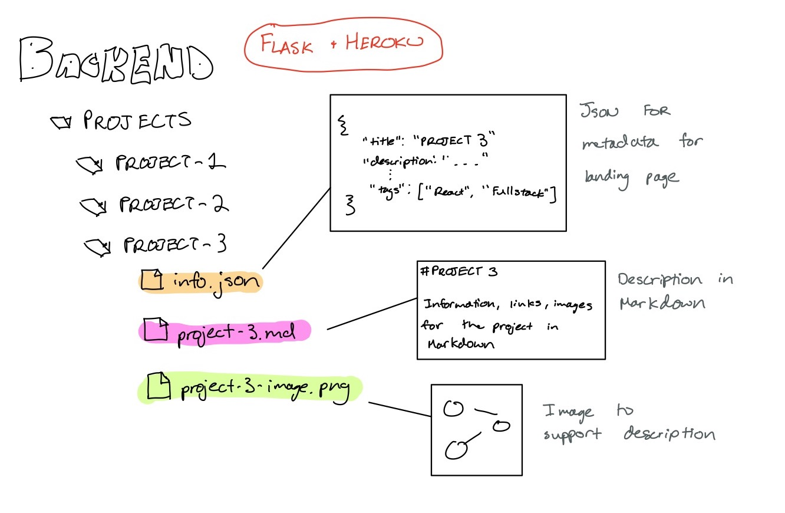
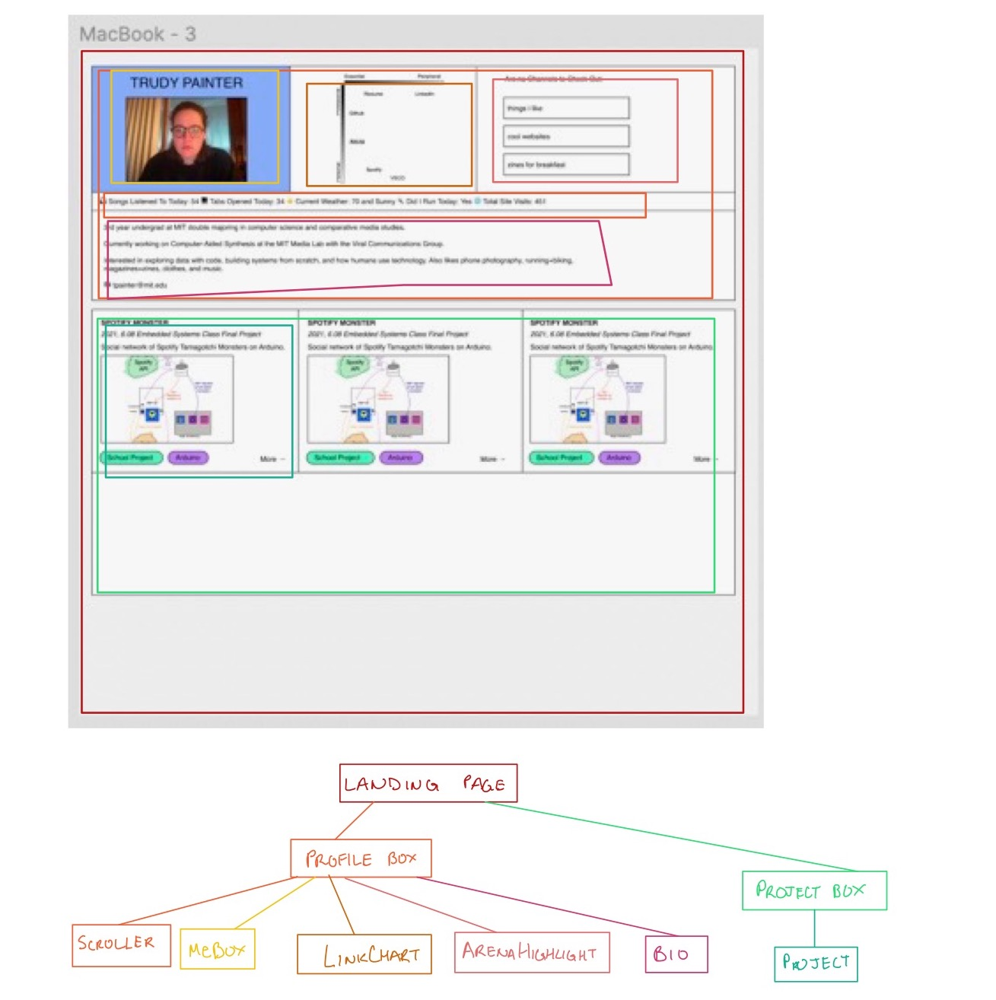
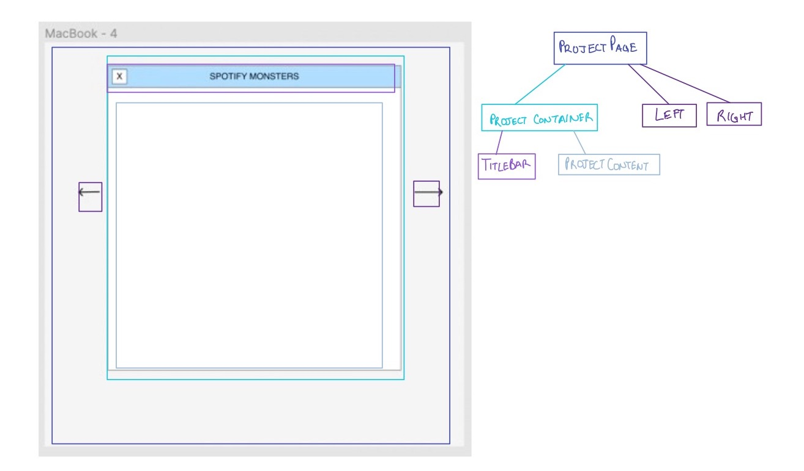

# TRUDY.COMPUTER

### Intentions

I wanted to make a website from scratch. I think [handmade websites](https://gossipsweb.net/) are [awesome](https://tilde.town/~zach/folk-html.html) and can be a great form of self expression.

There are lots of great [website generators](https://cargo.site/), but I wanted my website to be fully customizable and learn new skills during development.

When thinking about the [design of my personal website](https://thecreativeindependent.com/guides/how-to-make-a-website-for-your-creative-work/), I wanted to balance representing myself personally and professionally.

I want to feel comfortable sending my website to friends AND employers.

---

### Design

A lot of my minimalist/bruatlist web design inspiration is collected in this [Are.na channel](https://www.are.na/trudy-painter/ui-ux-e7l6cz6uksa).

The frontend is made with React. The backend is a Flask web server (hosted on Heroku) that serves Markdown files. The backend is a custom content management system I designed myself.

Below are diagrams from my initial design stages. And, you can look at how the system was made in this repository.

