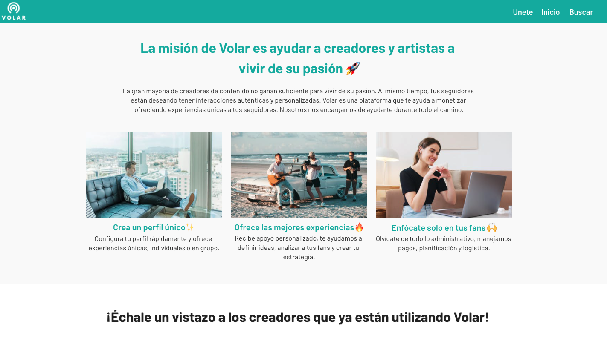

# VOLAR

Over January of 2021, I participated in an MIT Sloan startup incubator program called [Fuse](https://entrepreneurship.mit.edu/mit-fuse/#:~:text=MIT%20fuse%20is%20a%202,customized%20to%20your%20needs&text=a%20place%20to%20learn%20tactics,and%20valuable%20beyond%20startup%20life). I worked as a web developer and product manager for a startup called Volar.

Volar empowers the growing middle class of content creators in Latam with the business and software tools necessary to monetize their audience. Volar takes the core elements of Shopify (e-commerce, analytics, flexibility), and simplifies them specifically for creators so they can focus on their audience and content.

---

UPDATE: Volar has stopped development. I learned valuable skills developing a website across a language barrier and how to ideate at the initial stages of a startup, though.

The website was also taken down. This is the only screenshot I have of the platform.

