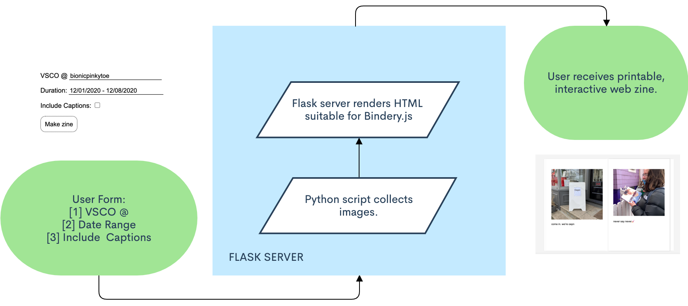

# VSCO ZINE CREATOR

I love taking pictures and zines. And, I thought the process of making photography zines was too tedious. So, I made this little Python server to generate zines from VSCO using the [Bindery JS library](https://evanbrooks.info/bindery/). (You can check out my Bindery project and others [here](https://evanbrooks.info/bindery/gallery/)!)

[Make your own VSCO zine!](https://vsco-zine.herokuapp.com/)

[Check out how I made this.](https://github.com/trudypainter/vsco-zine)

